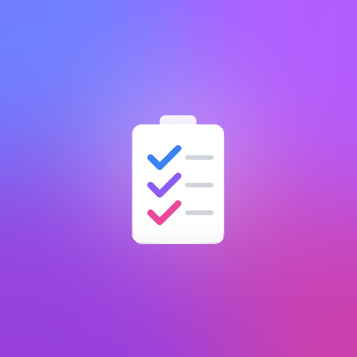

<p align="center">
  
</p>

<h1 align="center">PlanShake Theme Development Guide</h1>

<p align="center">
  <strong>Create beautiful custom themes for PlanShake</strong>
</p>

<p align="center">
  <a href="https://drive.google.com/file/d/1-tSVYT5SM1xlMWCNVRHFED1rzwZvzr0R/view?usp=sharing">📦 Download Default Theme</a> •
  <a href="#installing-your-theme">Installation</a> •
  <a href="#customization-tips">Customization</a>
</p>

---

## Quick Start

1. **[Download the Default Theme](https://drive.google.com/file/d/1-tSVYT5SM1xlMWCNVRHFED1rzwZvzr0R/view?usp=sharing)** as your starting template
2. Extract and rename the folder to your theme name (e.g., `MyAwesomeTheme`)
3. Customize the CSS files to your liking
4. Install your theme using one of the methods below

---

## Installing Your Theme

### Method 1: Settings Button (Recommended)

1. Open PlanShake
2. Click the **Settings** icon (⚙️) in the sidebar
3. Find the **Style Theme** dropdown
4. Click the **📁+** button next to the dropdown
5. Navigate to your theme folder and select it
6. Your theme will be automatically copied and applied!

### Method 2: Drag & Drop to Documents Folder

1. Navigate to your Documents folder:
   ```
   Documents/PlanShake/Themes/
   ```
   > **Note:** If the `Themes` folder doesn't exist, create it manually

2. Copy your entire theme folder into this directory
3. Restart PlanShake
4. Your theme will appear in the **Style Theme** dropdown in Settings

---

## Theme Folder Structure

A complete theme folder should contain these files:

```
YourThemeName/
├── main.css              # Entry point - imports all other CSS files
├── _variables.css        # Colors, fonts, spacing, and CSS variables
├── _base.css             # Typography, scrollbars, basic resets
├── _components.css       # Buttons, inputs, modals, cards, toggles
├── _layout.css           # Header, navigation, sidebar styles
├── _pages.css            # Page-specific styles (home, board, calendar, etc.)
├── _responsive.css       # Tablet and mobile responsive styles
├── _theme-dark.css       # Dark mode overrides
├── _contextmenu.css      # Right-click context menu styles
├── _splash.css           # Splash screen styling (optional)
├── icons/                # Icon images (PNG format)
│   ├── Bold.png
│   ├── Calender.png
│   ├── Save.png
│   └── ... (more icons)
└── SVGPath/              # SVG icons (optional, advanced)
    └── icons.json        # SVG definitions
```

---

## File Reference

### main.css

The entry point that imports all other CSS files. **Do not remove any imports** or the theme will break.

```css
@import '_variables.css';
@import '_base.css';
@import '_components.css';
@import '_layout.css';
@import '_pages.css';
@import '_responsive.css';
@import '_theme-dark.css';
@import '_contextmenu.css';
```

### _variables.css

This is where you define all your theme's core values. Customize these to change the entire look of PlanShake:

```css
:root {
    /* Material/Glass Effects */
    --mat-glass-base: rgba(255, 255, 255, 0.65);
    --glass-blur: blur(40px) saturate(180%);
    --glass-border: 1px solid rgba(255, 255, 255, 0.45);
    
    /* Colors */
    --text-primary: #1D1D1F;
    --text-secondary: #6e6e73;
    --accent-blue: #8181ff;
    --accent-green: #34C759;
    --accent-red: #FF3B30;
    
    /* Layout */
    --radius-panel: 24px;
    --radius-button: 999px;
    --header-height: 68px;
    
    /* Backgrounds */
    --bg-body: #eef0f2;
    --bg-surface: var(--mat-glass-base);
    
    /* Primary Button Color */
    --primary: var(--accent-blue);
    --primary-hover: #6b6bdd;
}
```

### _theme-dark.css

Contains all dark mode overrides. Styles here apply when the user selects "Dark" mode:

```css
[data-theme="dark"] {
    --bg-body: #0d0d1a;
    --text-primary: #f0f0f5;
    --text-secondary: #a0a0b0;
    /* ...other dark mode overrides */
}
```

---

## Customization Tips

### Changing Colors

Modify the color variables in `_variables.css`:

```css
:root {
    --accent-blue: #007AFF;      /* Primary accent */
    --accent-purple: #AF52DE;    /* Secondary accent */
    --accent-green: #34C759;     /* Success states */
    --accent-red: #FF3B30;       /* Danger/delete actions */
    --bg-body: #f5f5f7;          /* Page background */
}
```

### Changing Border Radius (Roundness)

```css
:root {
    --radius-panel: 24px;    /* Panels and cards */
    --radius-button: 999px;  /* Fully rounded buttons */
    --radius-input: 12px;    /* Input fields */
    --radius-sm: 12px;       /* Small elements */
    --radius-md: 20px;       /* Medium elements */
    --radius-lg: 32px;       /* Large elements */
}
```

For a sharp, angular look (like the Neo-Brutalist theme):
```css
:root {
    --radius-panel: 0px;
    --radius-button: 0px;
    --radius-input: 0px;
}
```

### Changing Glass/Blur Effects

```css
:root {
    /* Strong glass effect */
    --glass-blur: blur(40px) saturate(180%);
    
    /* Subtle glass effect */
    --glass-blur: blur(20px) saturate(120%);
    
    /* No glass effect (solid background) */
    --glass-blur: none;
}
```

### Customizing Shadows

```css
:root {
    /* Soft, subtle shadows */
    --shadow-sm: 0 2px 8px rgba(0, 0, 0, 0.04);
    --shadow-md: 0 12px 24px rgba(0, 0, 0, 0.06);
    
    /* Bold, hard shadows (Neo-Brutalist style) */
    --shadow-sm: 2px 2px 0px #000000;
    --shadow-md: 4px 4px 0px #000000;
}
```

---

## Custom Icons

### PNG Icons

Place PNG icons (24x24 pixels recommended) in the `icons/` folder. Icon filenames should match exactly:

- `Bold.png`
- `Calender.png`
- `Copy.png`
- `Save.png`
- etc.

### SVG Icons (Advanced)

For crisp, scalable icons, you can use SVG. Create `SVGPath/icons.json`:

```json
{
    "forceUseSvg": true,
    "Bold": "<svg xmlns=\"http://www.w3.org/2000/svg\" ...>...</svg>",
    "Save": "<svg xmlns=\"http://www.w3.org/2000/svg\" ...>...</svg>"
}
```

When `forceUseSvg` is `true`, PlanShake will use SVG icons regardless of user preference.

---

## Dark Mode Support

Always include dark mode overrides in `_theme-dark.css`. Use the `[data-theme="dark"]` selector:

```css
/* Dark mode button override */
[data-theme="dark"] .primary-btn {
    background: #6b6bff;
    color: white;
}

/* Dark mode input override */
[data-theme="dark"] input {
    background: rgba(0, 0, 0, 0.3);
    border-color: rgba(255, 255, 255, 0.1);
    color: white;
}
```

---

## Testing Your Theme

1. Install your theme using either method above
2. Select it from **Settings > Style Theme**
3. Test in both Light and Dark modes
4. Check all pages:
   - Home / Project Hub
   - Project Board (Kanban)
   - Calendar view
   - Gantt chart
   - Whiteboard
   - Notes editor
   - Settings modal

---

## Removing a Custom Theme

1. Open **Settings**
2. Select your custom theme
3. Click the **🗑️** button to remove it
4. The app will automatically switch back to the default theme

---

## Example Themes

### Default Theme
Clean, modern look with glass effects and subtle gradients.

### Neo-Brutalist Theme
Bold, sharp edges with high-contrast colors and hard shadows.

### NewTheme (Nature/Organic)
Earthy tones with forest-inspired colors and soft textures.

---

## Troubleshooting

**Theme not appearing in dropdown?**
- Make sure the folder contains at least one `.css` file
- Check if the folder is in `Documents/PlanShake/Themes/`
- Restart PlanShake

**Styles not applying correctly?**
- Check `main.css` imports are in the correct order
- CSS cascade order matters - dark theme must be last

**Icons look wrong?**
- Ensure PNG icons are 24x24 pixels
- Check filenames match exactly (case-sensitive)
- For dark mode, icons are auto-inverted

---

## Need Help?

If you have questions or want to share your theme:
- Check the example themes in the app
- Use the default theme as your starting point

Happy theming! 🎨
