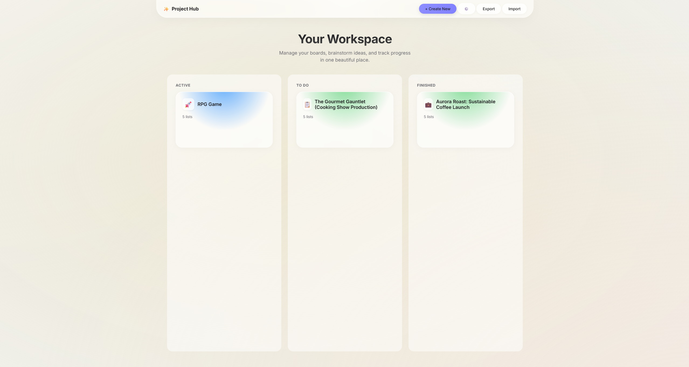
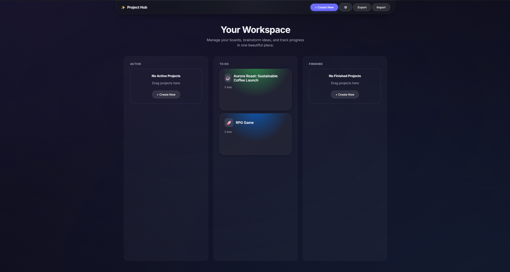
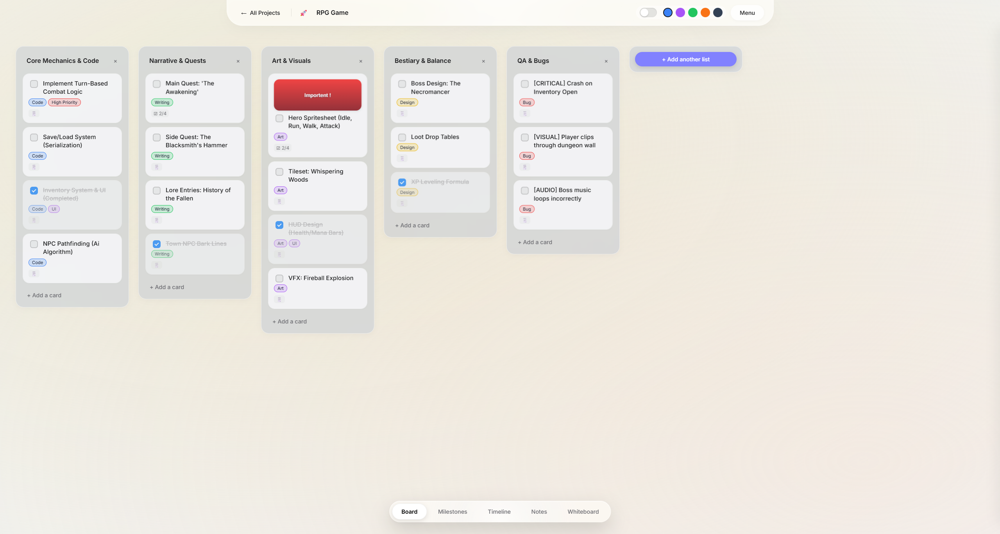
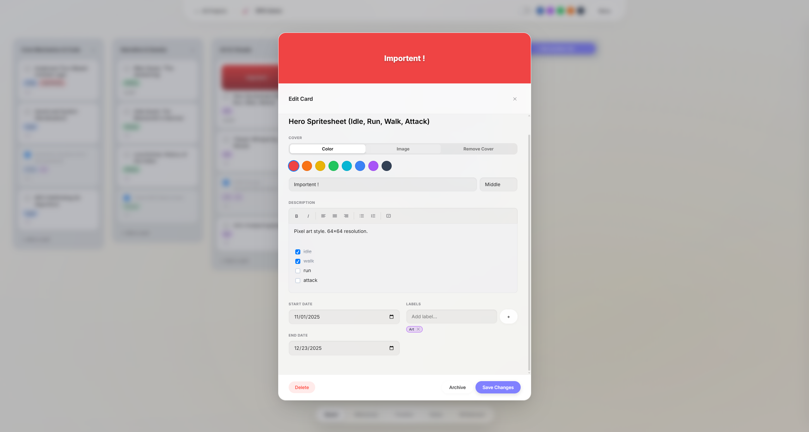
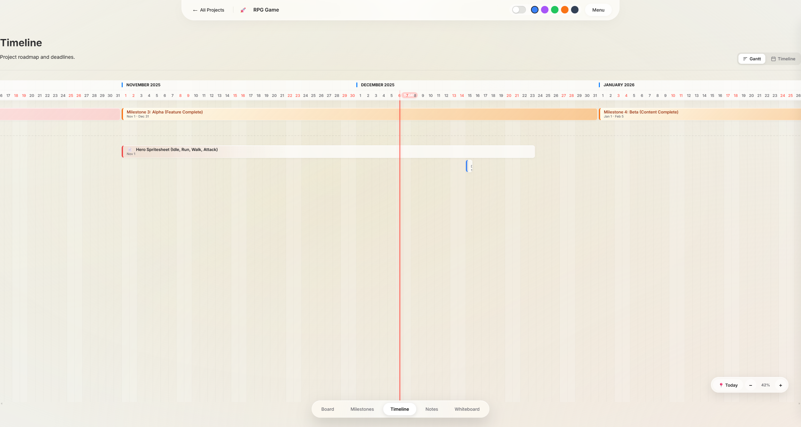
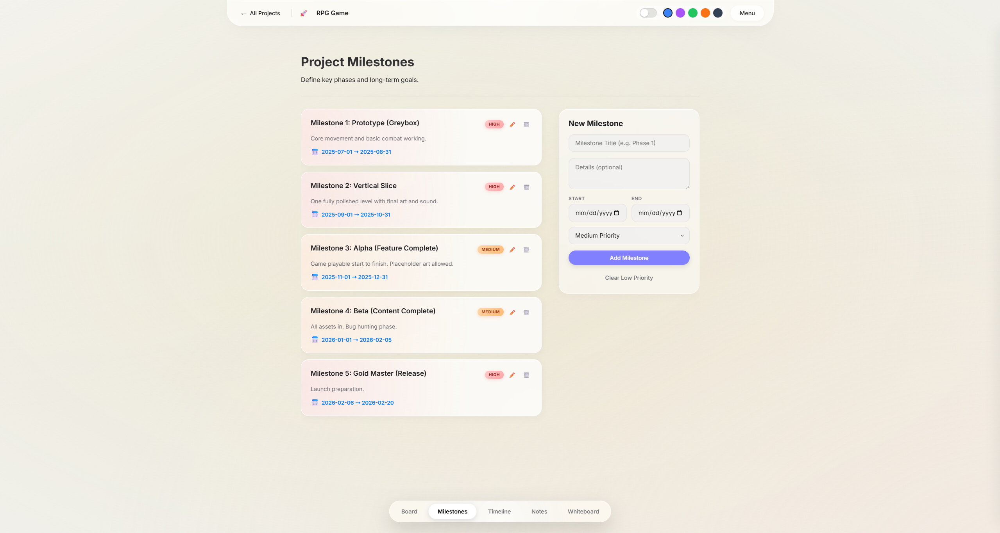
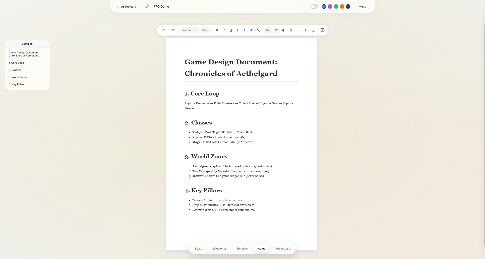
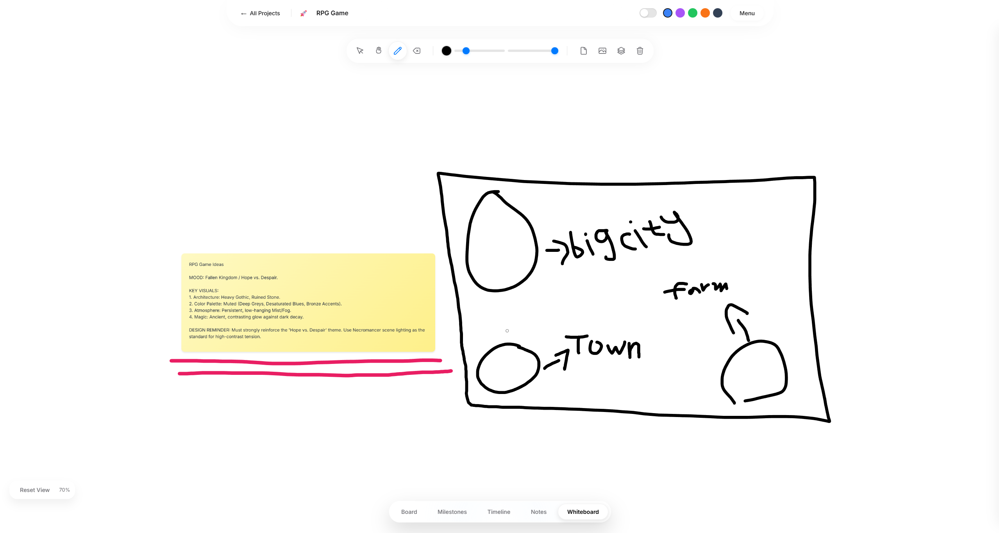

# PlanShake

  

  <strong>The Ultimate Offline-First Project Management Application</strong>

  
  
  

---

## About

**PlanShake** is a powerful, proprietary project management application designed for speed, privacy, and efficiency. Unlike cloud-based tools, PlanShake is **offline-first**, meaning all your data lives on your device. You own your data, and you can work anywhere without an internet connection.

Whether you are managing complex projects, sketching ideas on a whiteboard, or planning timelines, PlanShake provides a seamless, native experience.

## Key Features

PlanShake is packed with tools to help you organize your work. For a complete list of features, see **[Features.md](Features.md)**.

*   **Project Hub**: Manage multiple projects with custom icons and covers.
*   **Kanban Board**: Drag-and-drop tasks with rich details, checklists, and labels.
*   **Timeline & Calendar**: Visualize deadlines with Gantt charts and calendar views.
*   **Rich Notes**: Create detailed documents with a powerful rich text editor.
*   **Interactive Whiteboard**: Sketch, draw, and brainstorm on an infinite canvas.
*   **Privacy & Speed**: Zero latency, no loading screens, and full privacy.

## Gallery

| Project Hub | Dark Mode |
|:---:|:---:|
|  |  |

| Kanban Board | Card Details |
|:---:|:---:|
|  |  |

| Timeline | Milestones |
|:---:|:---:|
|  |  |

| Rich Notes | Whiteboard |
|:---:|:---:|
|  |  |

## Installation

### Desktop Application (Recommended)
Experience PlanShake as a native application on your operating system.
[**Download from AMRApps**](https://amrapps.netlify.app/app.html?id=planshake)

### Web Version
Try PlanShake directly in your browser (needs internet connection).
[**Launch Web App**](https://planshake.netlify.app/)

## Customization

PlanShake features a powerful theming engine. You can use built-in themes or create your own.

*   **[Theme Guide](Documentation/THEME_GUIDE.md)**: Learn how to create custom themes.
*   **[CSS Variables](Documentation/CSS_VARIABLES_REFERENCE.md)**: Reference for styling properties.

## Contact

Created by **AMR**.
Email: `abdulrhmanrabiah@gmail.com`

---

© PlanShake. All rights reserved.
